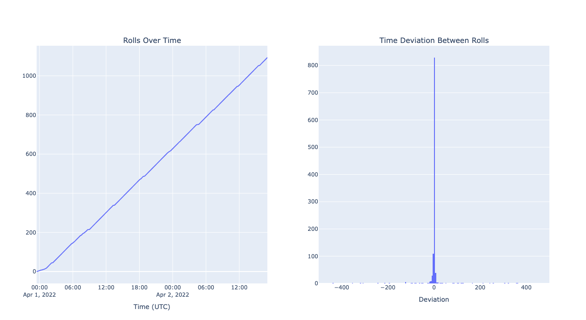

# Guyacha Stats

A total of **978 users** participated in a total of **75424 rolls**.

The bank gained **4525140 (452p 5g 1s 40c) gc** from users rolling, and paid out **2085540 (208p 5g 5s 40c) gc** rewards for a total of **2439600 (243p 9g 6s) gc** gain. Note that this doesn't include the intrinsic value of digital drops.

A total of **106 items** (47 of which were NFTs) were up for grabs. Most items could drop duplicates, but some were unique or limited (eg. NFTs, nitro, Genshin crystals).

The event lasted approximately **1 day, 18 hours**.

## Most Rolls

| Rank | User                       | Total Rolls |
| ---- | -------------------------- | ----------- |
| 1    | Snt#6565                   | 1094        |
| 2    | ActuallyShip#1312          | 1039        |
| 3    | Zenoth#2179                | 998         |
| 4    | Sycreon#6770               | 971         |
| 5    | Pyreko#8888                | 887         |
| 6    | anz007\_#6468              | 755         |
| 7    | Catge#4436                 | 677         |
| 8    | CyrenArkade#0001           | 666         |
| 9    | Renne#2622                 | 644         |
| 10   | TheCereo#0619              | 641         |
| 11   | noddy#1111                 | 604         |
| 12   | Mel#8672                   | 602         |
| 13   | Inglorion#3625             | 578         |
| 14   | starcontrast#9313          | 570         |
| 15   | Zevelth#4750               | 563         |
| 16   | sorahana✿#0003             | 560         |
| 17   | StabFree#1289              | 551         |
| 18   | Alexander Graham Bell#0001 | 533         |
| 19   | hypersound#1112            | 519         |
| 20   | ManVSLife#7792             | 500         |
| 21   | I want Sleep#6627          | 499         |
| 22   | HassouTobi#9200            | 487         |
| 23   | Insertanamehere#3766       | 485         |
| 24   | Ishi#7938                  | 484         |
| 25   | Kei#6405                   | 469         |

## Biggest GC Winners

| Rank | User                              | Net Gain |
| ---- | --------------------------------- | -------- |
| 1    | TheMatrix#3130                    | 860      |
| 2    | TerminalToaster#9297              | 700      |
| 3    | Aoki Tatsuya#5743                 | 690      |
| 4    | KafuuChino69#1274                 | 650      |
| 5    | Crownless Octo#2650               | 500      |
| 6    | NaCleric#3166                     | 440      |
| 7    | Nachop2#5182                      | 390      |
| 8    | pyro#5633                         | 370      |
| 9    | Tính Toàn Sai2001#7212            | 360      |
| 10   | not fujiwara#1804                 | 360      |
| 11   | Tokuchi#4360                      | 310      |
| 12   | 1234abc2#7899                     | 260      |
| 13   | barrowsx#0420                     | 260      |
| 14   | jimvissers97#0274                 | 240      |
| 15   | Eidvis#1646                       | 200      |
| 16   | Draco0100 (The Mama Kyoudai)#0816 | 200      |
| 17   | vexorian#9999                     | 180      |
| 18   | [GS] Raizou#7211                  | 130      |
| 19   | Durga#3345                        | 120      |
| 20   | tiny#3828                         | 120      |
| 21   | Amp Plinsa#2142                   | 100      |
| 22   | MagicFun#3969                     | 40       |
| 23   | Destruct0#6346                    | 40       |
| 24   | Razel-Treasure#0270               | 40       |
| 25   | Zintacj#6967                      | 40       |

## Biggest GC Losers

| Rank | User                       | Net Gain |
| ---- | -------------------------- | -------- |
| 1    | Sycreon#6770               | -35460   |
| 2    | Snt#6565                   | -34240   |
| 3    | ActuallyShip#1312          | -29130   |
| 4    | Zenoth#2179                | -27170   |
| 5    | Pyreko#8888                | -26900   |
| 6    | anz007\_#6468              | -22210   |
| 7    | Catge#4436                 | -22200   |
| 8    | Mel#8672                   | -21300   |
| 9    | TheCereo#0619              | -20770   |
| 10   | sorahana✿#0003             | -20130   |
| 11   | CyrenArkade#0001           | -19910   |
| 12   | starcontrast#9313          | -19190   |
| 13   | Zevelth#4750               | -18810   |
| 14   | Renne#2622                 | -18460   |
| 15   | noddy#1111                 | -17790   |
| 16   | ManVSLife#7792             | -17620   |
| 17   | Inglorion#3625             | -17390   |
| 18   | Insertanamehere#3766       | -17160   |
| 19   | StabFree#1289              | -17050   |
| 20   | Kei#6405                   | -16860   |
| 21   | NGSlave#9768               | -16310   |
| 22   | Alexander Graham Bell#0001 | -15880   |
| 23   | HassouTobi#9200            | -15840   |
| 24   | Hawx#3991                  | -15530   |
| 25   | poppyevil#9009             | -15400   |

## Got All Cards

These people got all cards, congrats!

| User             |
| ---------------- |
| Catge#4436       |
| Lizz71#8986      |
| Renne#2622       |
| CyrenArkade#0001 |
| Sycreon#6770     |
| Hawx#3991        |
| Zevelth#4750     |
| Rerr#7133        |
| PancakeMix#1911  |

## Fastest to a 6\* Card

| Rank | User                             | n-th Roll Until First 6\* Card |
| ---- | -------------------------------- | ------------------------------ |
| 1    | Tyrfing#0483                     | 1                              |
| 2    | Dr. Santu#9429                   | 1                              |
| 3    | Lightning Blade#5386             | 1                              |
| 4    | creativelyGarbled#2011           | 1                              |
| 5    | Aktarith#0613                    | 1                              |
| 6    | chankl2#4142                     | 1                              |
| 7    | Seagle#0219                      | 1                              |
| 8    | Martena#2783                     | 1                              |
| 9    | NotAFox#4265                     | 1                              |
| 10   | FlyingChicken#7265               | 1                              |
| 11   | Kei Shiromiya \| けいちゃん#5016 | 2                              |
| 12   | TheMole#3617                     | 2                              |
| 13   | Hawx#3991                        | 2                              |
| 14   | AbsoluteZero#5199                | 2                              |
| 15   | GriffMinester#8705               | 2                              |
| 16   | Langley#4050                     | 2                              |
| 17   | Bluster#1752                     | 2                              |
| 18   | adamng#4364                      | 2                              |
| 19   | DeathRe#6075                     | 2                              |
| 20   | spicyshawarma#2833               | 2                              |
| 21   | Leif#4141                        | 2                              |
| 22   | wakietrash#1750                  | 2                              |
| 23   | Chillisauce#3670                 | 2                              |
| 24   | Sanos#9321                       | 2                              |
| 25   | lemmi_william#3644               | 2                              |

## Slowest to a 6\* Card

| Rank | User                | n-th Roll Until First 6\* Card |
| ---- | ------------------- | ------------------------------ |
| 1    | noddy#1111          | 534                            |
| 2    | Halaman#2881        | 428                            |
| 3    | hypersound#1112     | 339                            |
| 4    | anz007\_#6468       | 325                            |
| 5    | silentdreamer#7626  | 276                            |
| 6    | Pyreko#8888         | 274                            |
| 7    | Lura#7006           | 271                            |
| 8    | NGSlave#9768        | 261                            |
| 9    | VoodooChile#1681    | 257                            |
| 10   | Sycreon#6770        | 254                            |
| 11   | Remy#0049           | 246                            |
| 12   | I want Sleep#6627   | 232                            |
| 13   | Lunarchy107#0468    | 222                            |
| 14   | Cabbe#1964          | 209                            |
| 15   | Renne#2622          | 202                            |
| 16   | Pfoe#1257           | 198                            |
| 17   | Daze#5117           | 194                            |
| 18   | frilly#8904         | 192                            |
| 19   | sorahana✿#0003      | 185                            |
| 20   | arimella#5127       | 184                            |
| 21   | masahiro#9149       | 175                            |
| 22   | Jayy\_#9082         | 158                            |
| 23   | WafflesRaffles#7372 | 141                            |
| 24   | pamcaek#8011        | 140                            |
| 25   | MaiNyan#3829        | 136                            |

## Most rolls without getting a 6\* Card

| Rank | User                                  | Rolls |
| ---- | ------------------------------------- | ----- |
| 1    | Orgiv#9544                            | 385   |
| 2    | Lum1nus#4246                          | 279   |
| 3    | sad pepe#1888                         | 215   |
| 4    | crimsonraes#7553                      | 200   |
| 5    | lionheart04#4896                      | 194   |
| 6    | Adholland#0772                        | 189   |
| 7    | SamnJamn#5478                         | 183   |
| 8    | 🌚Tsuki🌝#6969                        | 177   |
| 9    | Lord 19#7540                          | 173   |
| 10   | Gin sen & com#4122                    | 171   |
| 11   | 4Shady2Me#5413                        | 169   |
| 12   | Stuart#1681                           | 165   |
| 13   | Booty O's#2015                        | 151   |
| 14   | VikNik#9170                           | 147   |
| 15   | bongoneko#0108                        | 146   |
| 16   | D1D4C#9889                            | 145   |
| 17   | AardappelMiester#0733                 | 139   |
| 18   | Frostf14#8063                         | 138   |
| 19   | Gouda \| Ukiyo#9827                   | 131   |
| 20   | Horlof#4215                           | 130   |
| 21   | leanda#2091                           | 126   |
| 22   | norse god and capital of belarus#8470 | 122   |
| 23   | lce#8814                              | 122   |
| 24   | waoefu#3883                           | 117   |
| 25   | B4M#6189                              | 115   |

## Rolls Over Time

## Roll Rate

# More Stats

## Bots

This year, several users botted their way into ill-gotten gains.

While we didn't have any mechanisms to detect or deter this, we have roll data which we can apply some heuristics to in order to identify botters. One approximation is to plot a given user's roll and its timestamp and look for certain patterns. For example, strong linearity means that a given user probably botted their rolls. We could also take the second derivative to determine the deviation between roll times: a small range in deviation means they probably botted. However, it's not perfect because we have limited data.

As a benchmark, here's the roll time data for yours truly.

### Other Mods

Here's the same data for some of our mods that claimed they did not bot.

(The last one is a _bit_ suspect though)

### Known Botter

Here's the data for a known botter (they posted their script in the server).

### 1st Most Rolls

### 2nd Most Rolls

### 3rd Most Rolls

### 4th Most Rolls

### 5th Most Rolls

