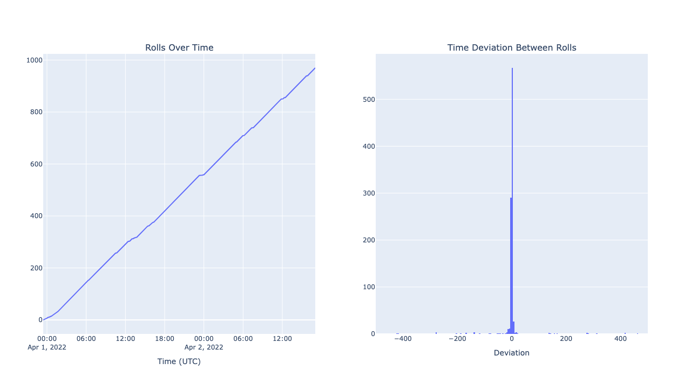

# Guyacha Stats

A total of **978 users** participated in a total of **75419 rolls**.

The bank gained **4525140 (452p 5g 1s 40c) gc** from users rolling, and paid out **2084540 (208p 4g 5s 40c) gc** rewards for a total of **2440600 (244p 6s) gc** gain. Note that this doesn't include the intrinsic value of digital drops.

A total of **106 items** (47 of which were NFTs) were up for grabs. Most items could drop duplicates, but some were unique or limited (eg. NFTs, nitro, Genshin crystals).

The event lasted approximately **1 day, 18 hours**.

Individual stats can be viewed [here](https://guya.cubari.moe/pages/guyacha-stats-2022/).

## Most Rolls

| Rank | User                                                                                                               | Total Rolls |
| ---- | ------------------------------------------------------------------------------------------------------------------ | ----------- |
| 1    | [Snt#6565](https://guya.cubari.moe/pages/guyacha-stats-2022/?u=Snt%236565)                                         | 1094        |
| 2    | [ActuallyShip#1312](https://guya.cubari.moe/pages/guyacha-stats-2022/?u=ActuallyShip%231312)                       | 1039        |
| 3    | [Zenoth#2179](https://guya.cubari.moe/pages/guyacha-stats-2022/?u=Zenoth%232179)                                   | 998         |
| 4    | [Sycreon#6770](https://guya.cubari.moe/pages/guyacha-stats-2022/?u=Sycreon%236770)                                 | 971         |
| 5    | [Pyreko#8888](https://guya.cubari.moe/pages/guyacha-stats-2022/?u=Pyreko%238888)                                   | 887         |
| 6    | [anz007\_#6468](https://guya.cubari.moe/pages/guyacha-stats-2022/?u=anz007_%236468)                                | 755         |
| 7    | [Catge#4436](https://guya.cubari.moe/pages/guyacha-stats-2022/?u=Catge%234436)                                     | 677         |
| 8    | [CyrenArkade#0001](https://guya.cubari.moe/pages/guyacha-stats-2022/?u=CyrenArkade%230001)                         | 666         |
| 9    | [Renne#2622](https://guya.cubari.moe/pages/guyacha-stats-2022/?u=Renne%232622)                                     | 644         |
| 10   | [TheCereo#0619](https://guya.cubari.moe/pages/guyacha-stats-2022/?u=TheCereo%230619)                               | 641         |
| 11   | [noddy#1111](https://guya.cubari.moe/pages/guyacha-stats-2022/?u=noddy%231111)                                     | 604         |
| 12   | [Mel#8672](https://guya.cubari.moe/pages/guyacha-stats-2022/?u=Mel%238672)                                         | 602         |
| 13   | [Inglorion#3625](https://guya.cubari.moe/pages/guyacha-stats-2022/?u=Inglorion%233625)                             | 578         |
| 14   | [starcontrast#9313](https://guya.cubari.moe/pages/guyacha-stats-2022/?u=starcontrast%239313)                       | 570         |
| 15   | [Zevelth#4750](https://guya.cubari.moe/pages/guyacha-stats-2022/?u=Zevelth%234750)                                 | 563         |
| 16   | [sorahana✿#0003](https://guya.cubari.moe/pages/guyacha-stats-2022/?u=sorahana%E2%9C%BF%230003)                     | 560         |
| 17   | [StabFree#1289](https://guya.cubari.moe/pages/guyacha-stats-2022/?u=StabFree%231289)                               | 551         |
| 18   | [Alexander Graham Bell#0001](https://guya.cubari.moe/pages/guyacha-stats-2022/?u=Alexander%20Graham%20Bell%230001) | 533         |
| 19   | [hypersound#1112](https://guya.cubari.moe/pages/guyacha-stats-2022/?u=hypersound%231112)                           | 519         |
| 20   | [ManVSLife#7792](https://guya.cubari.moe/pages/guyacha-stats-2022/?u=ManVSLife%237792)                             | 500         |
| 21   | [I want Sleep#6627](https://guya.cubari.moe/pages/guyacha-stats-2022/?u=I%20want%20Sleep%236627)                   | 499         |
| 22   | [HassouTobi#9200](https://guya.cubari.moe/pages/guyacha-stats-2022/?u=HassouTobi%239200)                           | 487         |
| 23   | [Insertanamehere#3766](https://guya.cubari.moe/pages/guyacha-stats-2022/?u=Insertanamehere%233766)                 | 485         |
| 24   | [Ishi#7938](https://guya.cubari.moe/pages/guyacha-stats-2022/?u=Ishi%237938)                                       | 484         |
| 25   | [Kei#6405](https://guya.cubari.moe/pages/guyacha-stats-2022/?u=Kei%236405)                                         | 469         |

## Biggest GC Winners

| Rank | User                                                                                                                                 | Net Gain |
| ---- | ------------------------------------------------------------------------------------------------------------------------------------ | -------- |
| 1    | [TheMatrix#3130](https://guya.cubari.moe/pages/guyacha-stats-2022/?u=TheMatrix%233130)                                               | 860      |
| 2    | [TerminalToaster#9297](https://guya.cubari.moe/pages/guyacha-stats-2022/?u=TerminalToaster%239297)                                   | 700      |
| 3    | [Aoki Tatsuya#5743](https://guya.cubari.moe/pages/guyacha-stats-2022/?u=Aoki%20Tatsuya%235743)                                       | 690      |
| 4    | [KafuuChino69#1274](https://guya.cubari.moe/pages/guyacha-stats-2022/?u=KafuuChino69%231274)                                         | 650      |
| 5    | [Crownless Octo#2650](https://guya.cubari.moe/pages/guyacha-stats-2022/?u=Crownless%20Octo%232650)                                   | 500      |
| 6    | [NaCleric#3166](https://guya.cubari.moe/pages/guyacha-stats-2022/?u=NaCleric%233166)                                                 | 440      |
| 7    | [Nachop2#5182](https://guya.cubari.moe/pages/guyacha-stats-2022/?u=Nachop2%235182)                                                   | 390      |
| 8    | [pyro#5633](https://guya.cubari.moe/pages/guyacha-stats-2022/?u=pyro%235633)                                                         | 370      |
| 9    | [Tính Toàn Sai2001#7212](https://guya.cubari.moe/pages/guyacha-stats-2022/?u=T%C3%ADnh%20To%C3%A0n%20Sai2001%237212)                 | 360      |
| 10   | [not fujiwara#1804](https://guya.cubari.moe/pages/guyacha-stats-2022/?u=not%20fujiwara%231804)                                       | 360      |
| 11   | [Tokuchi#4360](https://guya.cubari.moe/pages/guyacha-stats-2022/?u=Tokuchi%234360)                                                   | 310      |
| 12   | [1234abc2#7899](https://guya.cubari.moe/pages/guyacha-stats-2022/?u=1234abc2%237899)                                                 | 260      |
| 13   | [barrowsx#0420](https://guya.cubari.moe/pages/guyacha-stats-2022/?u=barrowsx%230420)                                                 | 260      |
| 14   | [jimvissers97#0274](https://guya.cubari.moe/pages/guyacha-stats-2022/?u=jimvissers97%230274)                                         | 240      |
| 15   | [Eidvis#1646](https://guya.cubari.moe/pages/guyacha-stats-2022/?u=Eidvis%231646)                                                     | 200      |
| 16   | [Draco0100 (The Mama Kyoudai)#0816](<https://guya.cubari.moe/pages/guyacha-stats-2022/?u=Draco0100%20(The%20Mama%20Kyoudai)%230816>) | 200      |
| 17   | [vexorian#9999](https://guya.cubari.moe/pages/guyacha-stats-2022/?u=vexorian%239999)                                                 | 180      |
| 18   | [\[GS\] Raizou#7211](https://guya.cubari.moe/pages/guyacha-stats-2022/?u=%5BGS%5D%20Raizou%237211)                                   | 130      |
| 19   | [Durga#3345](https://guya.cubari.moe/pages/guyacha-stats-2022/?u=Durga%233345)                                                       | 120      |
| 20   | [tiny#3828](https://guya.cubari.moe/pages/guyacha-stats-2022/?u=tiny%233828)                                                         | 120      |
| 21   | [Amp Plinsa#2142](https://guya.cubari.moe/pages/guyacha-stats-2022/?u=Amp%20Plinsa%232142)                                           | 100      |
| 22   | [MagicFun#3969](https://guya.cubari.moe/pages/guyacha-stats-2022/?u=MagicFun%233969)                                                 | 40       |
| 23   | [Destruct0#6346](https://guya.cubari.moe/pages/guyacha-stats-2022/?u=Destruct0%236346)                                               | 40       |
| 24   | [Razel-Treasure#0270](https://guya.cubari.moe/pages/guyacha-stats-2022/?u=Razel-Treasure%230270)                                     | 40       |
| 25   | [Zintacj#6967](https://guya.cubari.moe/pages/guyacha-stats-2022/?u=Zintacj%236967)                                                   | 40       |

## Biggest GC Losers

| Rank | User                                                                                                               | Net Gain |
| ---- | ------------------------------------------------------------------------------------------------------------------ | -------- |
| 1    | [Sycreon#6770](https://guya.cubari.moe/pages/guyacha-stats-2022/?u=Sycreon%236770)                                 | -35460   |
| 2    | [Snt#6565](https://guya.cubari.moe/pages/guyacha-stats-2022/?u=Snt%236565)                                         | -34240   |
| 3    | [ActuallyShip#1312](https://guya.cubari.moe/pages/guyacha-stats-2022/?u=ActuallyShip%231312)                       | -29130   |
| 4    | [Zenoth#2179](https://guya.cubari.moe/pages/guyacha-stats-2022/?u=Zenoth%232179)                                   | -27170   |
| 5    | [Pyreko#8888](https://guya.cubari.moe/pages/guyacha-stats-2022/?u=Pyreko%238888)                                   | -26900   |
| 6    | [anz007\_#6468](https://guya.cubari.moe/pages/guyacha-stats-2022/?u=anz007_%236468)                                | -22210   |
| 7    | [Catge#4436](https://guya.cubari.moe/pages/guyacha-stats-2022/?u=Catge%234436)                                     | -22200   |
| 8    | [Mel#8672](https://guya.cubari.moe/pages/guyacha-stats-2022/?u=Mel%238672)                                         | -21300   |
| 9    | [TheCereo#0619](https://guya.cubari.moe/pages/guyacha-stats-2022/?u=TheCereo%230619)                               | -20770   |
| 10   | [sorahana✿#0003](https://guya.cubari.moe/pages/guyacha-stats-2022/?u=sorahana%E2%9C%BF%230003)                     | -20130   |
| 11   | [CyrenArkade#0001](https://guya.cubari.moe/pages/guyacha-stats-2022/?u=CyrenArkade%230001)                         | -19910   |
| 12   | [starcontrast#9313](https://guya.cubari.moe/pages/guyacha-stats-2022/?u=starcontrast%239313)                       | -19190   |
| 13   | [Zevelth#4750](https://guya.cubari.moe/pages/guyacha-stats-2022/?u=Zevelth%234750)                                 | -18810   |
| 14   | [Renne#2622](https://guya.cubari.moe/pages/guyacha-stats-2022/?u=Renne%232622)                                     | -18460   |
| 15   | [noddy#1111](https://guya.cubari.moe/pages/guyacha-stats-2022/?u=noddy%231111)                                     | -17790   |
| 16   | [ManVSLife#7792](https://guya.cubari.moe/pages/guyacha-stats-2022/?u=ManVSLife%237792)                             | -17620   |
| 17   | [Inglorion#3625](https://guya.cubari.moe/pages/guyacha-stats-2022/?u=Inglorion%233625)                             | -17390   |
| 18   | [Insertanamehere#3766](https://guya.cubari.moe/pages/guyacha-stats-2022/?u=Insertanamehere%233766)                 | -17160   |
| 19   | [StabFree#1289](https://guya.cubari.moe/pages/guyacha-stats-2022/?u=StabFree%231289)                               | -17050   |
| 20   | [Kei#6405](https://guya.cubari.moe/pages/guyacha-stats-2022/?u=Kei%236405)                                         | -16860   |
| 21   | [NGSlave#9768](https://guya.cubari.moe/pages/guyacha-stats-2022/?u=NGSlave%239768)                                 | -16310   |
| 22   | [Alexander Graham Bell#0001](https://guya.cubari.moe/pages/guyacha-stats-2022/?u=Alexander%20Graham%20Bell%230001) | -15880   |
| 23   | [HassouTobi#9200](https://guya.cubari.moe/pages/guyacha-stats-2022/?u=HassouTobi%239200)                           | -15840   |
| 24   | [Hawx#3991](https://guya.cubari.moe/pages/guyacha-stats-2022/?u=Hawx%233991)                                       | -15530   |
| 25   | [poppyevil#9009](https://guya.cubari.moe/pages/guyacha-stats-2022/?u=poppyevil%239009)                             | -15400   |

## Got All Cards

These people got all cards, congrats!

| User                                                                                       |
| ------------------------------------------------------------------------------------------ |
| [Catge#4436](https://guya.cubari.moe/pages/guyacha-stats-2022/?u=Catge%234436)             |
| [Lizz71#8986](https://guya.cubari.moe/pages/guyacha-stats-2022/?u=Lizz71%238986)           |
| [Renne#2622](https://guya.cubari.moe/pages/guyacha-stats-2022/?u=Renne%232622)             |
| [CyrenArkade#0001](https://guya.cubari.moe/pages/guyacha-stats-2022/?u=CyrenArkade%230001) |
| [Sycreon#6770](https://guya.cubari.moe/pages/guyacha-stats-2022/?u=Sycreon%236770)         |
| [Hawx#3991](https://guya.cubari.moe/pages/guyacha-stats-2022/?u=Hawx%233991)               |
| [Zevelth#4750](https://guya.cubari.moe/pages/guyacha-stats-2022/?u=Zevelth%234750)         |
| [Rerr#7133](https://guya.cubari.moe/pages/guyacha-stats-2022/?u=Rerr%237133)               |
| [PancakeMix#1911](https://guya.cubari.moe/pages/guyacha-stats-2022/?u=PancakeMix%231911)   |

## Fastest to a 6\* Card

| Rank | User                                                                                                                                                                 | n-th Roll Until First 6\* Card |
| ---- | -------------------------------------------------------------------------------------------------------------------------------------------------------------------- | ------------------------------ |
| 1    | [Tyrfing#0483](https://guya.cubari.moe/pages/guyacha-stats-2022/?u=Tyrfing%230483)                                                                                   | 1                              |
| 2    | [Dr. Santu#9429](https://guya.cubari.moe/pages/guyacha-stats-2022/?u=Dr.%20Santu%239429)                                                                             | 1                              |
| 3    | [Lightning Blade#5386](https://guya.cubari.moe/pages/guyacha-stats-2022/?u=Lightning%20Blade%235386)                                                                 | 1                              |
| 4    | [creativelyGarbled#2011](https://guya.cubari.moe/pages/guyacha-stats-2022/?u=creativelyGarbled%232011)                                                               | 1                              |
| 5    | [Aktarith#0613](https://guya.cubari.moe/pages/guyacha-stats-2022/?u=Aktarith%230613)                                                                                 | 1                              |
| 6    | [chankl2#4142](https://guya.cubari.moe/pages/guyacha-stats-2022/?u=chankl2%234142)                                                                                   | 1                              |
| 7    | [Seagle#0219](https://guya.cubari.moe/pages/guyacha-stats-2022/?u=Seagle%230219)                                                                                     | 1                              |
| 8    | [Martena#2783](https://guya.cubari.moe/pages/guyacha-stats-2022/?u=Martena%232783)                                                                                   | 1                              |
| 9    | [NotAFox#4265](https://guya.cubari.moe/pages/guyacha-stats-2022/?u=NotAFox%234265)                                                                                   | 1                              |
| 10   | [FlyingChicken#7265](https://guya.cubari.moe/pages/guyacha-stats-2022/?u=FlyingChicken%237265)                                                                       | 1                              |
| 11   | [Kei Shiromiya \| けいちゃん#5016](https://guya.cubari.moe/pages/guyacha-stats-2022/?u=Kei%20Shiromiya%20%7C%20%E3%81%91%E3%81%84%E3%81%A1%E3%82%83%E3%82%93%235016) | 2                              |
| 12   | [TheMole#3617](https://guya.cubari.moe/pages/guyacha-stats-2022/?u=TheMole%233617)                                                                                   | 2                              |
| 13   | [Hawx#3991](https://guya.cubari.moe/pages/guyacha-stats-2022/?u=Hawx%233991)                                                                                         | 2                              |
| 14   | [AbsoluteZero#5199](https://guya.cubari.moe/pages/guyacha-stats-2022/?u=AbsoluteZero%235199)                                                                         | 2                              |
| 15   | [GriffMinester#8705](https://guya.cubari.moe/pages/guyacha-stats-2022/?u=GriffMinester%238705)                                                                       | 2                              |
| 16   | [Langley#4050](https://guya.cubari.moe/pages/guyacha-stats-2022/?u=Langley%234050)                                                                                   | 2                              |
| 17   | [Bluster#1752](https://guya.cubari.moe/pages/guyacha-stats-2022/?u=Bluster%231752)                                                                                   | 2                              |
| 18   | [adamng#4364](https://guya.cubari.moe/pages/guyacha-stats-2022/?u=adamng%234364)                                                                                     | 2                              |
| 19   | [DeathRe#6075](https://guya.cubari.moe/pages/guyacha-stats-2022/?u=DeathRe%236075)                                                                                   | 2                              |
| 20   | [spicyshawarma#2833](https://guya.cubari.moe/pages/guyacha-stats-2022/?u=spicyshawarma%232833)                                                                       | 2                              |
| 21   | [Leif#4141](https://guya.cubari.moe/pages/guyacha-stats-2022/?u=Leif%234141)                                                                                         | 2                              |
| 22   | [wakietrash#1750](https://guya.cubari.moe/pages/guyacha-stats-2022/?u=wakietrash%231750)                                                                             | 2                              |
| 23   | [Chillisauce#3670](https://guya.cubari.moe/pages/guyacha-stats-2022/?u=Chillisauce%233670)                                                                           | 2                              |
| 24   | [Sanos#9321](https://guya.cubari.moe/pages/guyacha-stats-2022/?u=Sanos%239321)                                                                                       | 2                              |
| 25   | [lemmi_william#3644](https://guya.cubari.moe/pages/guyacha-stats-2022/?u=lemmi_william%233644)                                                                       | 2                              |

## Slowest to a 6\* Card

| Rank | User                                                                                             | n-th Roll Until First 6\* Card |
| ---- | ------------------------------------------------------------------------------------------------ | ------------------------------ |
| 1    | [noddy#1111](https://guya.cubari.moe/pages/guyacha-stats-2022/?u=noddy%231111)                   | 534                            |
| 2    | [Halaman#2881](https://guya.cubari.moe/pages/guyacha-stats-2022/?u=Halaman%232881)               | 428                            |
| 3    | [hypersound#1112](https://guya.cubari.moe/pages/guyacha-stats-2022/?u=hypersound%231112)         | 339                            |
| 4    | [anz007\_#6468](https://guya.cubari.moe/pages/guyacha-stats-2022/?u=anz007_%236468)              | 325                            |
| 5    | [silentdreamer#7626](https://guya.cubari.moe/pages/guyacha-stats-2022/?u=silentdreamer%237626)   | 276                            |
| 6    | [Pyreko#8888](https://guya.cubari.moe/pages/guyacha-stats-2022/?u=Pyreko%238888)                 | 274                            |
| 7    | [Lura#7006](https://guya.cubari.moe/pages/guyacha-stats-2022/?u=Lura%237006)                     | 271                            |
| 8    | [NGSlave#9768](https://guya.cubari.moe/pages/guyacha-stats-2022/?u=NGSlave%239768)               | 261                            |
| 9    | [VoodooChile#1681](https://guya.cubari.moe/pages/guyacha-stats-2022/?u=VoodooChile%231681)       | 257                            |
| 10   | [Sycreon#6770](https://guya.cubari.moe/pages/guyacha-stats-2022/?u=Sycreon%236770)               | 254                            |
| 11   | [Remy#0049](https://guya.cubari.moe/pages/guyacha-stats-2022/?u=Remy%230049)                     | 246                            |
| 12   | [I want Sleep#6627](https://guya.cubari.moe/pages/guyacha-stats-2022/?u=I%20want%20Sleep%236627) | 232                            |
| 13   | [Lunarchy107#0468](https://guya.cubari.moe/pages/guyacha-stats-2022/?u=Lunarchy107%230468)       | 222                            |
| 14   | [Cabbe#1964](https://guya.cubari.moe/pages/guyacha-stats-2022/?u=Cabbe%231964)                   | 209                            |
| 15   | [Renne#2622](https://guya.cubari.moe/pages/guyacha-stats-2022/?u=Renne%232622)                   | 202                            |
| 16   | [Pfoe#1257](https://guya.cubari.moe/pages/guyacha-stats-2022/?u=Pfoe%231257)                     | 198                            |
| 17   | [Daze#5117](https://guya.cubari.moe/pages/guyacha-stats-2022/?u=Daze%235117)                     | 194                            |
| 18   | [frilly#8904](https://guya.cubari.moe/pages/guyacha-stats-2022/?u=frilly%238904)                 | 192                            |
| 19   | [sorahana✿#0003](https://guya.cubari.moe/pages/guyacha-stats-2022/?u=sorahana%E2%9C%BF%230003)   | 185                            |
| 20   | [arimella#5127](https://guya.cubari.moe/pages/guyacha-stats-2022/?u=arimella%235127)             | 184                            |
| 21   | [masahiro#9149](https://guya.cubari.moe/pages/guyacha-stats-2022/?u=masahiro%239149)             | 175                            |
| 22   | [Jayy\_#9082](https://guya.cubari.moe/pages/guyacha-stats-2022/?u=Jayy_%239082)                  | 158                            |
| 23   | [WafflesRaffles#7372](https://guya.cubari.moe/pages/guyacha-stats-2022/?u=WafflesRaffles%237372) | 141                            |
| 24   | [pamcaek#8011](https://guya.cubari.moe/pages/guyacha-stats-2022/?u=pamcaek%238011)               | 140                            |
| 25   | [MaiNyan#3829](https://guya.cubari.moe/pages/guyacha-stats-2022/?u=MaiNyan%233829)               | 136                            |

## Most rolls without getting a 6\* Card

| Rank | User                                                                                                                                           | Rolls |
| ---- | ---------------------------------------------------------------------------------------------------------------------------------------------- | ----- |
| 1    | [Orgiv#9544](https://guya.cubari.moe/pages/guyacha-stats-2022/?u=Orgiv%239544)                                                                 | 385   |
| 2    | [Lum1nus#4246](https://guya.cubari.moe/pages/guyacha-stats-2022/?u=Lum1nus%234246)                                                             | 279   |
| 3    | [sad pepe#1888](https://guya.cubari.moe/pages/guyacha-stats-2022/?u=sad%20pepe%231888)                                                         | 215   |
| 4    | [crimsonraes#7553](https://guya.cubari.moe/pages/guyacha-stats-2022/?u=crimsonraes%237553)                                                     | 200   |
| 5    | [lionheart04#4896](https://guya.cubari.moe/pages/guyacha-stats-2022/?u=lionheart04%234896)                                                     | 194   |
| 6    | [Adholland#0772](https://guya.cubari.moe/pages/guyacha-stats-2022/?u=Adholland%230772)                                                         | 189   |
| 7    | [SamnJamn#5478](https://guya.cubari.moe/pages/guyacha-stats-2022/?u=SamnJamn%235478)                                                           | 183   |
| 8    | [🌚Tsuki🌝#6969](https://guya.cubari.moe/pages/guyacha-stats-2022/?u=%F0%9F%8C%9ATsuki%F0%9F%8C%9D%236969)                                     | 177   |
| 9    | [Lord 19#7540](https://guya.cubari.moe/pages/guyacha-stats-2022/?u=Lord%2019%237540)                                                           | 173   |
| 10   | [Gin sen & com#4122](https://guya.cubari.moe/pages/guyacha-stats-2022/?u=Gin%20sen%20%26%20com%234122)                                         | 171   |
| 11   | [4Shady2Me#5413](https://guya.cubari.moe/pages/guyacha-stats-2022/?u=4Shady2Me%235413)                                                         | 169   |
| 12   | [Stuart#1681](https://guya.cubari.moe/pages/guyacha-stats-2022/?u=Stuart%231681)                                                               | 165   |
| 13   | [Booty O's#2015](https://guya.cubari.moe/pages/guyacha-stats-2022/?u=Booty%20O's%232015)                                                       | 151   |
| 14   | [VikNik#9170](https://guya.cubari.moe/pages/guyacha-stats-2022/?u=VikNik%239170)                                                               | 147   |
| 15   | [bongoneko#0108](https://guya.cubari.moe/pages/guyacha-stats-2022/?u=bongoneko%230108)                                                         | 146   |
| 16   | [D1D4C#9889](https://guya.cubari.moe/pages/guyacha-stats-2022/?u=D1D4C%239889)                                                                 | 145   |
| 17   | [AardappelMiester#0733](https://guya.cubari.moe/pages/guyacha-stats-2022/?u=AardappelMiester%230733)                                           | 139   |
| 18   | [Frostf14#8063](https://guya.cubari.moe/pages/guyacha-stats-2022/?u=Frostf14%238063)                                                           | 138   |
| 19   | [Gouda \| Ukiyo#9827](https://guya.cubari.moe/pages/guyacha-stats-2022/?u=Gouda%20%7C%20Ukiyo%239827)                                          | 131   |
| 20   | [Horlof#4215](https://guya.cubari.moe/pages/guyacha-stats-2022/?u=Horlof%234215)                                                               | 130   |
| 21   | [leanda#2091](https://guya.cubari.moe/pages/guyacha-stats-2022/?u=leanda%232091)                                                               | 126   |
| 22   | [norse god and capital of belarus#8470](https://guya.cubari.moe/pages/guyacha-stats-2022/?u=norse%20god%20and%20capital%20of%20belarus%238470) | 122   |
| 23   | [lce#8814](https://guya.cubari.moe/pages/guyacha-stats-2022/?u=lce%238814)                                                                     | 122   |
| 24   | [waoefu#3883](https://guya.cubari.moe/pages/guyacha-stats-2022/?u=waoefu%233883)                                                               | 117   |
| 25   | [B4M#6189](https://guya.cubari.moe/pages/guyacha-stats-2022/?u=B4M%236189)                                                                     | 115   |

## Rolls Over Time

## Roll Rate

# More Stats

## Bots

This year, several users botted their way into ill-gotten gains.

While we didn't have any mechanisms to detect or deter this, we have roll data which we can apply some heuristics to in order to identify botters. One approximation is to plot a given user's roll and its timestamp and look for certain patterns. For example, strong linearity means that a given user probably botted their rolls. We could also take the second derivative to determine the deviation between roll times: a small range in deviation means they probably botted. However, it's not perfect because we have limited data.

As a benchmark, here's the roll time data for yours truly.

### Other Mods

Here's the same data for some of our mods that claimed they did not bot.

(The last one is a _bit_ suspect though)

### Known Botter

Here's the data for a known botter (they posted their script in the server).

### 1st Most Rolls

### 2nd Most Rolls

### 3rd Most Rolls

### 4th Most Rolls

### 5th Most Rolls

