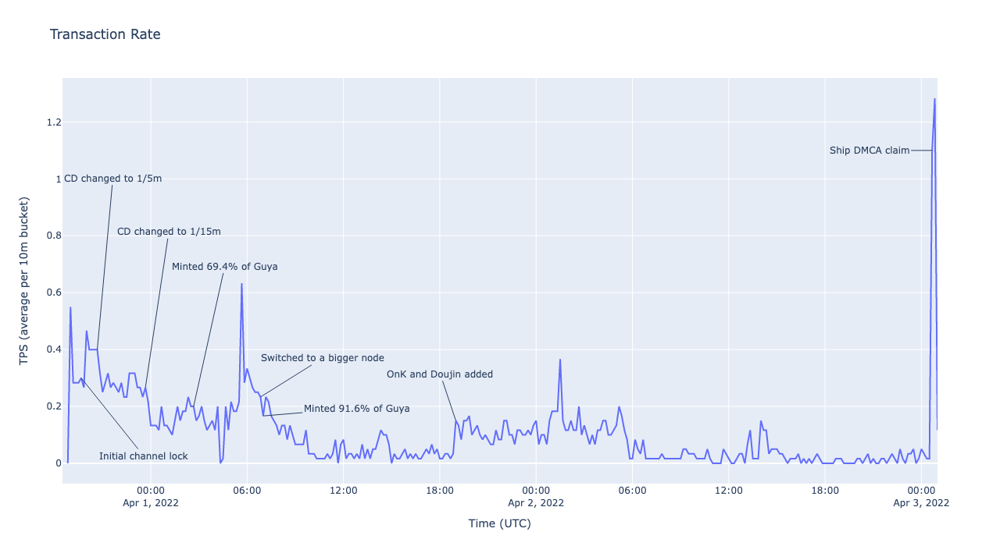

# NFTs

Overall, **8403 unique NFTs** were minted or transacted among **938 users**. Of those 938, **911 users** held NFTs by the end of the event.

A total of **10454 transactions** were confirmed.

The event lasted approximately **2 days, 6 hours**.

The single known validator node has been active since the event, consuming **3 months, 18 hours** worth of server time at the time of writing.

The average TPS was **very low**. [0]

Interested in exploring the data yourself? The [client](https://github.com/subject-f/nfgt-client) and [chain](https://github.com/subject-f/beacon-chain) are publicly available.

---

[0] This is a consequence of Discord's rate limits; the NFGT client can otherwise sustain ~25 TPS on the cheapest DO droplet (assuming all other conditions are optimal)

## Stats

### Earned the most GC on NFTs

| Rank | User            | Raw GC | GC           |
| ---- | --------------- | ------ | ------------ |
| 1    | Halaman#2881    | 36609  | 3p 6g 6s 9c  |
| 2    | Inglorion#3625  | 22540  | 2p 2g 5s 40c |
| 3    | Snt#6565        | 22521  | 2p 2g 5s 21c |
| 4    | sorahana✿#0003  | 19681  | 1p 9g 6s 81c |
| 5    | MrTacobell#5944 | 19500  | 1p 9g 5s     |
| 6    | Zenoth#2179     | 16105  | 1p 6g 1s 5c  |
| 7    | Kei#6405        | 13700  | 1p 3g 7s     |
| 8    | Zevelth#4750    | 11260  | 1p 1g 2s 60c |
| 9    | Pyreko#8888     | 11210  | 1p 1g 2s 10c |
| 10   | arimella#5127   | 10450  | 1p 4s 50c    |

### Spent the most GC on NFTs

| Rank | User            | Raw GC | GC            |
| ---- | --------------- | ------ | ------------- |
| 1    | appu#4444       | -29581 | -2p 9g 5s 81c |
| 2    | tanaka#4662     | -28149 | -2p 8g 1s 49c |
| 3    | noddy#1111      | -12950 | -1p 2g 9s 50c |
| 4    | llDannyll#2435  | -12200 | -1p 2g 2s     |
| 5    | muscleHime#9323 | -11998 | -1p 1g 9s 98c |
| 6    | lhbdawn#4277    | -11770 | -1p 1g 7s 70c |
| 7    | vexorian#9999   | -9977  | -9g 9s 77c    |
| 8    | Mel#8672        | -9538  | -9g 5s 38c    |
| 9    | FocusMiss#2772  | -9500  | -9g 5s        |
| 10   | Cronos#9991     | -9096  | -9g 96c       |

### Highest Value Transactions

| Rank | Transaction                                                                                                      | NFT                                                                                                             | Raw GC | GC  |
| ---- | ---------------------------------------------------------------------------------------------------------------- | --------------------------------------------------------------------------------------------------------------- | ------ | --- |
| 1    | [transaction](https://github.com/subject-f/beacon-chain/blob/560cd339-2269-4965-a9da-4986d75358d4/metadata.json) | [m-1-2](https://guya.moe/media/manga/Kaguya-Wants-To-Be-Confessed-To/chapters/0001_9rr4clfz/1/02.jpg?v4)        | 10000  | 1p  |
| 2    | [transaction](https://github.com/subject-f/beacon-chain/blob/1fd0e909-a927-494a-994e-ce14bd937772/metadata.json) | [m-137-19](https://guya.moe/media/manga/Kaguya-Wants-To-Be-Confessed-To/chapters/0137_zbxj7yc0/3/19.png)        | 10000  | 1p  |
| 3    | [transaction](https://github.com/subject-f/beacon-chain/blob/cff921d6-97d5-4343-9b75-0fec211641ea/metadata.json) | [m-199-14](https://guya.moe/media/manga/Kaguya-Wants-To-Be-Confessed-To/chapters/0199_wovs7g75/3/14.png?v2)     | 10000  | 1p  |
| 4    | [transaction](https://github.com/subject-f/beacon-chain/blob/b1685a31-5356-4807-9b83-33e33701fdd5/metadata.json) | [m-221.1-18](https://guya.moe/media/manga/Kaguya-Wants-To-Be-Confessed-To/chapters/0221-1_pbleptdk/7/18.jpg?v2) | 10000  | 1p  |
| 5    | [transaction](https://github.com/subject-f/beacon-chain/blob/44039729-cd53-4057-b0ce-28e1889948bf/metadata.json) | [m-202-18](https://guya.moe/media/manga/Kaguya-Wants-To-Be-Confessed-To/chapters/0202_7ugj9de1/7/18.png?v6)     | 8000   | 8g  |
| 6    | [transaction](https://github.com/subject-f/beacon-chain/blob/d5a31c49-59c4-4ede-b11b-42cc110172f6/metadata.json) | [m-47-10](https://guya.moe/media/manga/Kaguya-Wants-To-Be-Confessed-To/chapters/0047_mwa3ii20/1/10.png)         | 8000   | 8g  |
| 7    | [transaction](https://github.com/subject-f/beacon-chain/blob/fbc094a2-d83a-4596-8182-4dd9912ab23a/metadata.json) | [m-9-18](https://guya.moe/media/manga/Kaguya-Wants-To-Be-Confessed-To/chapters/0009_b0nftgph/1/18_w.png?v3)     | 8000   | 8g  |
| 8    | [transaction](https://github.com/subject-f/beacon-chain/blob/c6179855-62aa-4a70-869e-71826b54ce8a/metadata.json) | [m-137-19](https://guya.moe/media/manga/Kaguya-Wants-To-Be-Confessed-To/chapters/0137_zbxj7yc0/3/19.png)        | 8000   | 8g  |
| 9    | [transaction](https://github.com/subject-f/beacon-chain/blob/bd94ec1a-6fac-4e9f-b34c-f8c5502e1169/metadata.json) | [m-241.1-1](https://guya.moe/media/manga/Kaguya-Wants-To-Be-Confessed-To/chapters/0241-1_fxkbf07c/7/01.jpg)     | 7000   | 7g  |
| 10   | [transaction](https://github.com/subject-f/beacon-chain/blob/b6bc4aea-d84e-4ecb-b1ed-75acfe8eaebc/metadata.json) | [m-211-15](https://guya.moe/media/manga/Kaguya-Wants-To-Be-Confessed-To/chapters/0211_egwoy225/7/15.png?v5)     | 7000   | 7g  |

### Lowest Value Transactions

Unfortunately, this metric isn't very interesting since many pages were sold for 1c. However, if we filter out the 1c pages, we get the following:

| Rank | Transaction                                                                                                      | NFT                                                                                                                    | Raw GC | GC  |
| ---- | ---------------------------------------------------------------------------------------------------------------- | ---------------------------------------------------------------------------------------------------------------------- | ------ | --- |
| 1    | [transaction](https://github.com/subject-f/beacon-chain/blob/ebc36ac7-342b-47e4-ba90-fa9d6fdeef96/metadata.json) | [4k-11-2](https://guya.moe/media/manga/We-Want-To-Talk-About-Kaguya/chapters/0011_4yywxdqo/3/2_w.png)                  | 2      | 2c  |
| 2    | [transaction](https://github.com/subject-f/beacon-chain/blob/5c41f083-94e7-4df7-8082-45581fac3460/metadata.json) | [4k-50-4](https://guya.moe/media/manga/We-Want-To-Talk-About-Kaguya/chapters/0050_1bmn8816/2/4.jpg)                    | 2      | 2c  |
| 3    | [transaction](https://github.com/subject-f/beacon-chain/blob/14117bba-90ea-47f7-b2a2-336f8879b9e2/metadata.json) | [4k-9-4](https://guya.moe/media/manga/We-Want-To-Talk-About-Kaguya/chapters/0009_htxr7e2d/3/4.png)                     | 4      | 4c  |
| 4    | [transaction](https://github.com/subject-f/beacon-chain/blob/9e25d62f-bd0e-4235-a019-60300a3680e6/metadata.json) | [4k-165-4](https://guya.moe/media/manga/We-Want-To-Talk-About-Kaguya/chapters/0165_84sli3si/7/4.png?v3)                | 4      | 4c  |
| 5    | [transaction](https://github.com/subject-f/beacon-chain/blob/21e9c0c9-0d1e-4361-b9e4-56b7bf322636/metadata.json) | [4k-142-2](https://guya.moe/media/manga/We-Want-To-Talk-About-Kaguya/chapters/0142_wrddounq/7/2.png)                   | 4      | 4c  |
| 6    | [transaction](https://github.com/subject-f/beacon-chain/blob/898b220e-bb25-435b-8df7-45782c3ad992/metadata.json) | [do-16-7](https://guya.moe/media/manga/Kaguya-Wants-To-Be-Confessed-To-Official-Doujin/chapters/0016_1bqkokir/3/7.png) | 5      | 5c  |
| 7    | [transaction](https://github.com/subject-f/beacon-chain/blob/6e36adc2-f892-474c-826d-a21e317892d0/metadata.json) | [onk-47-1](https://guya.moe/media/manga/Oshi-no-Ko/chapters/0047_3q8is266/5/01.jpg)                                    | 5      | 5c  |
| 8    | [transaction](https://github.com/subject-f/beacon-chain/blob/ff42baf1-443a-439f-9041-efd374a477e5/metadata.json) | [onk-47-3](https://guya.moe/media/manga/Oshi-no-Ko/chapters/0047_3q8is266/5/03.png)                                    | 5      | 5c  |
| 9    | [transaction](https://github.com/subject-f/beacon-chain/blob/9cae4a27-5e88-4c31-8b38-57a7b13fe431/metadata.json) | [m-201.1-15](https://guya.moe/media/manga/Kaguya-Wants-To-Be-Confessed-To/chapters/0201-1_kpmz3mjp/7/15.jpg?v2)        | 5      | 5c  |
| 10   | [transaction](https://github.com/subject-f/beacon-chain/blob/6cdabbee-6949-4c7f-ba8a-394814f70c1b/metadata.json) | [4k-44-4](https://guya.moe/media/manga/We-Want-To-Talk-About-Kaguya/chapters/0044_b45i6uqi/2/4.jpg)                    | 5      | 5c  |

### GC Cost Over Time

I had initially assumed that transactions would drop in price as time goes on. This may be true for pending transactions (those existed on another layer outside of the chain, similar to how NFT marketplaces operate), but the actual cost of confirmed transactions stayed relatively constant over time:

### Most transactions for a single NFT

| Rank | NFT                                                                                                             | Transactions |
| ---- | --------------------------------------------------------------------------------------------------------------- | ------------ |
| 1    | [m-221.1-18](https://guya.moe/media/manga/Kaguya-Wants-To-Be-Confessed-To/chapters/0221-1_pbleptdk/7/18.jpg?v2) | 6            |
| 2    | [onk-74-23](https://guya.moe/media/manga/Oshi-no-Ko/chapters/0074_87tdm466/5/23.png)                            | 5            |
| 3    | [4k-115-6](https://guya.moe/media/manga/We-Want-To-Talk-About-Kaguya/chapters/0115_pqt9z4i1/7/6.jpg?v3)         | 5            |
| 4    | [m-216-19](https://guya.moe/media/manga/Kaguya-Wants-To-Be-Confessed-To/chapters/0216_9fgknj5x/7/19.jpg?v3)     | 5            |
| 5    | [m-121.1-7](https://guya.moe/media/manga/Kaguya-Wants-To-Be-Confessed-To/chapters/0121-1_njf4ycqk/3/07.png)     | 5            |
| 6    | [m-243-20](https://guya.moe/media/manga/Kaguya-Wants-To-Be-Confessed-To/chapters/0243_omasl85c/7/20_w.png)      | 5            |
| 7    | [m-170-5](https://guya.moe/media/manga/Kaguya-Wants-To-Be-Confessed-To/chapters/0170_dzebm1dy/3/05.png?v2)      | 5            |
| 8    | [m-145-12](https://guya.moe/media/manga/Kaguya-Wants-To-Be-Confessed-To/chapters/0145_ucz2tfhu/3/12.png?v2)     | 5            |
| 9    | [m-218-19](https://guya.moe/media/manga/Kaguya-Wants-To-Be-Confessed-To/chapters/0218_n1oh7dui/7/19.jpg?v2)     | 5            |
| 10   | [m-192-19](https://guya.moe/media/manga/Kaguya-Wants-To-Be-Confessed-To/chapters/0192_lel5n195/3/19.png?v7)     | 5            |

### Most NFTs

| Rank | User                      | Number of NFTs |
| ---- | ------------------------- | -------------- |
| 1    | tanaka#4662               | 234            |
| 2    | Eason#0857                | 192            |
| 3    | Toadtoad#7629             | 153            |
| 4    | vexorian#9999             | 142            |
| 5    | Vinh(popdragonquest)#3826 | 137            |
| 6    | Daze#5117                 | 135            |
| 7    | Catge#4436                | 112            |
| 8    | Sycreon#6770              | 106            |
| 9    | GreatPerm#8766            | 101            |
| 10   | ActuallyShip#1312         | 100            |

### Average number of NFTs

A user had an average of 9.22 NFTs. However, the median was 2. It was extremely top heavy:

And for the number of users who owned under 25 NFTs:

### Transactions Over Time

### Transaction Rate (TPS)

### Transaction Time

This graph is interesting since there was a noticeable improvement in transaction times after doubling the node capacity. The initial node started swapping to disk much more often, resulting in an increase in transaction times before we switched to a bigger node.

