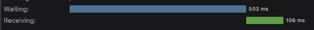
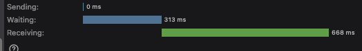
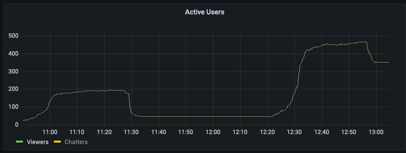
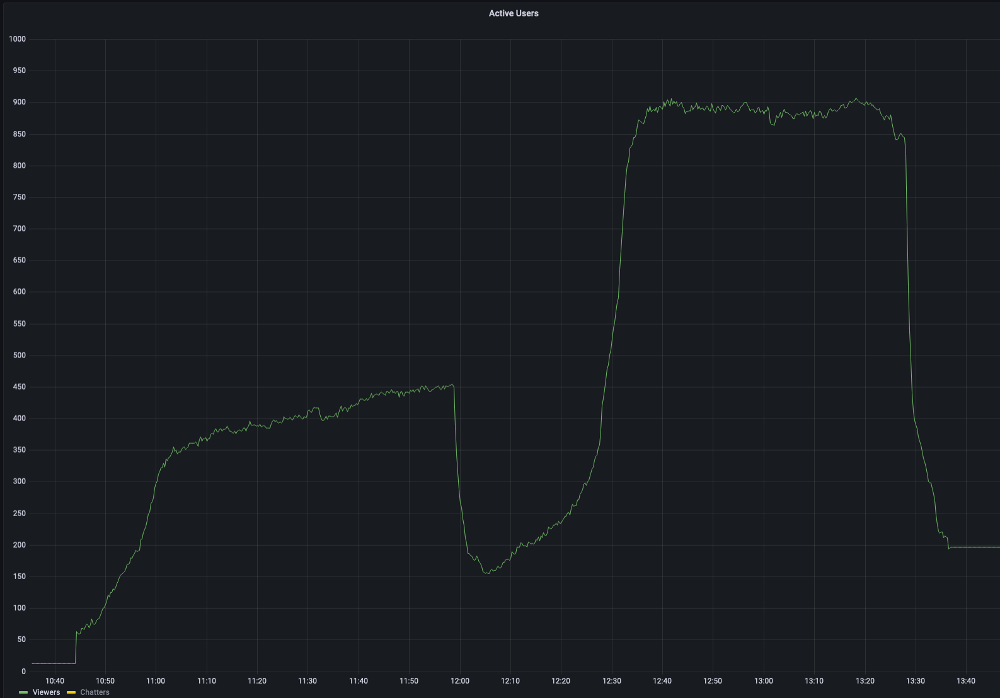
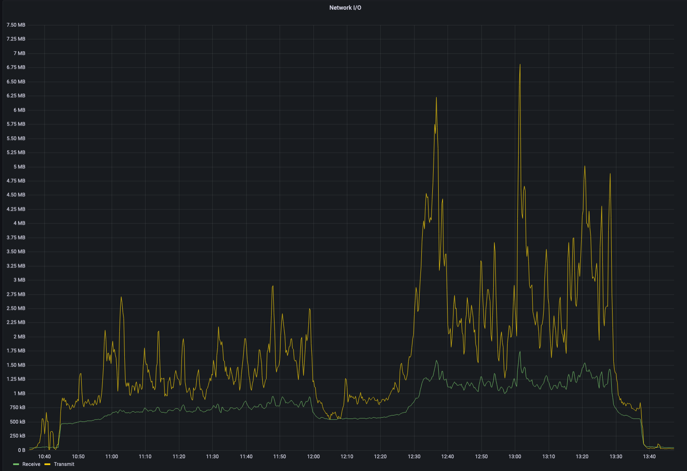
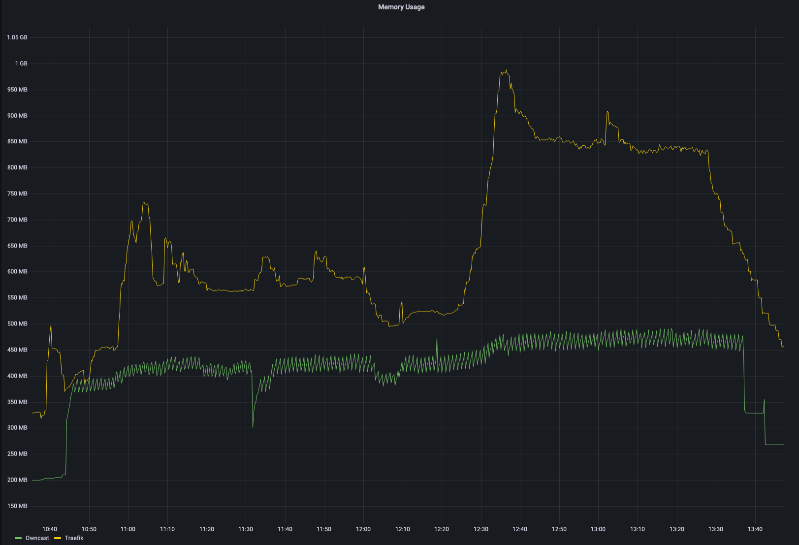
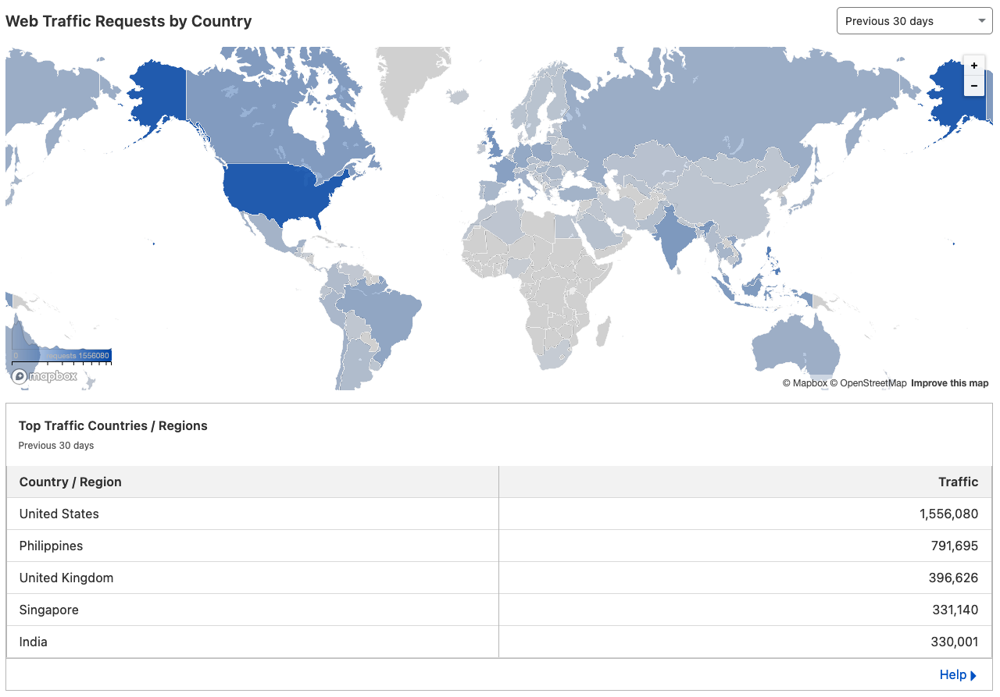

# 2022 Groupwatch

No one asked for this but here we go.

## Why?

We wanted to continue our tradition of hosting groupwatches of the live broadcast from Japan TV and the subs immediately after release on Crunchyroll/Funimation since season 1. 

For season 1, we used rabb.it service, it worked *fine* for just small groups of people up to 100 at a time but it became defunct before season 2. For the second season, we used [cytu.be](https://cytu.be/r/Kaguya) which worked alright up to 1000 viewers but the chat would choke and cause a crazy load on their servers. 

After season 2, the server considerably exploded in size, so for season 3, I wanted to be more independent and use our own raw resources without too much reliance on other volunteer project services such as rabb.it or cytu.be. Originally, I wanted to build something amazing from scratch with Algoinde but he was too busy playing Genshin and dealing with his irl situation. So I set out to find something off the shelf that we can modify to suit our needs, there were several projects but the most feature "complete" is [Owncast](https://owncast.online/).

## Infrastructure

We have our software which can just go on my existing server, now we just need a way to deliver the video to people all over the world, the real challenge. We couldn't just serve the video directly from a server in the US because people on the opposite side of the world would just not download the video fast enough to play it smoothly. NA and EU people would be fine if they have decent enough peering (ISP connections to other ISPs), not so much for South America, Asia, Oceania. 

Owncast has an option to send the video to an S3 compatible storage for viewers to pull the video from, so we had to just find one that offered a CDN in front to maximize global reach. We started with Backblaze B2 with Cloudflare Bandwidth Alliance[^1][^2], it worked amazingly well for extremely cheap. However Cloudflare didn't like how we were streaming live video through that and bonked us[^3]. Then we tried Contabo's Object Storage[^4], since it was the second cheapest option, only costing $2.50/month with unlimited egress bandwidth and used Cloudflare's CDN. It worked fine for 2 weeks then became extremely throttled, you get what you pay for I guess. So, we jumped over to DigitalOcean's S3 Spaces[^5] and stuck to it for the rest of the season since it worked fine.

Since we modified Owncast for our needs and needed a fast way to build Docker images, we just made a [fork](https://github.com/subject-f/owncast) and just used GitHub's actions to build and deploy on my Hetzner VPS with Traefik as the reverse proxy. I also used Prometheus and Grafana for metrics logging and graphs.

## Changes during "production"

Luckily, we had a low volume rewatch just prior to season 3 to test things out which did not actually prepare us for the real groupwatches.

We had to switch between multiple S3+CDN services as described earlier. We started with Backblaze B2 with Cloudflare but Cloudflare didn't like how we were "abusing" their free plan for live video streaming. Contabo worked alright but you would have very long GET request times for each segment, it would frequently go in excess of one second for the HLS segments.

Despite the long GET times, it worked alright for most people. Then, it just stopped working properly after 2 weeks. We didn't have time to really figure out why and just had to get something working immediately so we switched to DigitalOcean's S3 Spaces and it worked out for the rest of the season. We didn't want to change anything further after that. Also early on, we lowered the max bitrate from 6Mbps to 3Mbps and that seemed to resolve buffering issues for most people. The portion of people that had buffering issues went from 30% to less than 5%. After the 5th week, we finally ironed out the game breaking problems and the rest of the season went by smoothly. We only had problems with logistics of streaming the input from Abema and Crunchyroll.

## Owncast Modifications

- We wanted to have a bridge to Discord so Funky added a rudimentary bot so we can have mirrored chat both ways.
- Early on in the first few weeks, we had too many people joining at once deadlocking the database due to some poor concurrency code with the chat enabled since there was an database transaction event for every time someone "connects" and "disconnects". Funky found a fix and submitted a [PR upstream :)](https://github.com/owncast/owncast/pull/1833). At first, we just disabled Owncast chat and used Discord for reacts and talk but that wasn't a real solution.
- The volume of chat spam would overwhelm the slow sqlite database so we just didn't persist the history at all. [21d099](https://github.com/subject-f/owncast/commit/21d099d87a076476fe5a06b0f25e0a868ee53ad2) Our persistent archive ended up being the Discord threads.
- Emojis weren't parsing correctly with the chat mirroring, funky also added a fix: [abe740b](https://github.com/subject-f/owncast/commit/abe740ba542f5259c205e679489492aa8a3e051b)
- Naturally, we had bad actors spamming bad stuff so we had to add a filter to silently drop messages and limited message lengths: [312dc86](https://github.com/subject-f/owncast/commit/312dc8643a0fc4fbc9f157f0d3ea0fdb09886613), [0282cdc](https://github.com/subject-f/owncast/commit/0282cdc96cd9c8db0dfbcd39ee6d9dce8582b939)

## Costs

First, the cost breakdown:

| Month     | Hetzner    | DigitalOcean | Total       |
| --------- | ---------- | ------------ | ----------- |
| April     | $10.37     | $38.70       | $49.07      | 
| May       | $13.05     | $17.56       | $30.61      |
| June      | $13.22     | $34.06       | $47.28      |
| **Total** | **$36.64** | **$90.32**   | **$126.96** |

I used `CPX31` tier on the Hetzner Cloud in US which was €11.90/mo for 4 vCPUs and 8GB of RAM which was overkill but it helped for the last week for episodes 12 and 13.

DigitalOcean's S3 Spaces is $5/month for 1024GiB of outbound bandwidth with $0.01 per GiB overage[^6], we paid so much in overages due to the amount of bandwidth. DigitalOcean doesn't have proper user visible metrics (which is why you shouldn't use them) such as bandwidth usage, but we can just extrapolate from the overages.

## Metrics and Grafs

I stupidly set the data retention period to 30 days in Prometheus when I started this whole project so I only have the last 4 weeks of data in Grafana as I write this.

We had a consistent viewership of 400-550 viewers for the subbed groupwatches with around 150-250 for the raws restream. The second timeslot 12 hours after subbed release were typically around 100-150 viewers. Typical graph for most of the episodes, left half is the raw and right half is the subs.

Except for the last week for episodes 12 and 13: raws started at 330 climbing to 450 at the end. Subbed was consistently 900 the entire time.

Chat volume was so heavy that Owncast peaked at almost 7MB/s network throughput (minus 1MB/s for the S3 output).

Due to how Go memory management works, Owncast and Traefik spiked at 1.4GB combined RAM usage at the start of the subbed groupwatch for episodes 12 and 13.

Cloudflare says we used about 5-10GB per week directly from Owncast (the site itself, chat, emotes) except for the last week when it reached 30GB. We don't have exact metrics of bandwidth usage for the stream but we can extrapolate from the overages:

| Month     | Overages | Bandwidth     |
| --------- | -------- | ------------- |
| April     | $33.70   | 4718 GB      |
| May       | $12.56   | 2448 GB      | 
| June      | $29.06   | 4220 GB      |
| **Total** |          | **11386 GB** |

We streamed a total of approximately 11.4TB of video from the CDN to viewers!

## Special Thanks

Huge thanks to appu, funkyhippo, meli, Tanaka, noddy for helping out to make this groupwatch happen (mostly) smoothly, I couldn't have done it all myself. ~~Until next time, season 4 never.~~

Thanks for reading.

-Ionplasma

[^1]: https://help.backblaze.com/hc/en-us/articles/217666928-Using-Backblaze-B2-with-the-Cloudflare-CDN
[^2]: https://blog.cloudflare.com/backblaze-b2-and-the-s3-compatible-api-on-cloudflare/
[^3]: https://support.cloudflare.com/hc/en-us/articles/360057976851-Delivering-Videos-with-Cloudflare#h_17ENJA5McX8FiFmwFhbacY
[^4]: https://owncast.online/docs/storage/contabo/
[^5]: https://owncast.online/docs/storage/digitalocean/
[^6]: https://docs.digitalocean.com/products/spaces/details/pricing/
